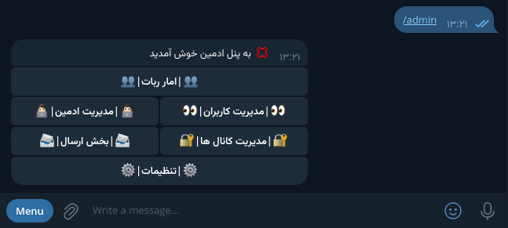

## English | انگلیسی
# 🌟 Plus Saver - Telegram Bot

Plus Saver is a unique Telegram bot developed using the Python programming language and the Telethon library. This bot allows users to easily download various content from popular platforms and also gives administrators complete control over users and channels.

## 🚀 Features and Capabilities

### Admin Section

1. **Admin Management**:
   - ➕ Add Admin
   - ➖ Remove Admin 
   - 👁 View Admins

2. **User Section**:
   - 🚫 Ban User
   - 🔓 Unban User
   - 📝 User Details

3. **Channel Management**:
   - ➕ Add Locked Channel
   - ➖ Remove Channel
   - 👁 View Channels

4. **Sending Section**:
   - 📤 Send to a user by numeric ID
   - 📤 Send to all users

5. **Settings**:
   - ✍️ Change Terms Text
   - ✍️ Change Help Text
   - ✍️ Change Help Channel

6. **Bot Statistics**:
   - 📊 Number of Users
   - 📊 Number of Locked Channels

---

### User Section

1. 🎥 Download from YouTube
2. 📸 Download from Instagram
3. 🎵 Download from Spotify
4. 📌 Download from Pinterest
5. 🎶 Download from TikTok
6. 🎧 Download from SoundCloud
7. 📜 Terms and Conditions
8. 📚 Help
9. 📞 Contact Us (Send Support ID)
10. 💖 Donate (Send Wallet Link, etc.)
11. 👤 Creator (Send Bot Creator ID)

---

## 🛠 How to Set Up the Bot

To set up Plus Saver, follow these steps:

1. **Enter the config folder**:
   - Navigate to the folder where the bot is located and then enter the config folder.

2. **Edit the config.py file**:
   - Open the config.py file with a text editor.
   - Enter the required information such as bot token and other settings.

3. **Run the man.py file**:
   - After saving changes in config.py, return to the main bot folder and run the man.py file.

Experience an unparalleled way to download content and manage users on Telegram with Plus Saver! 🌈

## Persian | فارسی

# 🌟 Plus Saver - ربات تلگرام

Plus Saver یک ربات تلگرام منحصر به فرد است که با استفاده از زبان برنامه‌نویسی Python و کتابخانه Telethon توسعه یافته است. این ربات به کاربران این امکان را می‌دهد که به راحتی محتوای مختلف را از پلتفرم‌های محبوب دانلود کنند و همچنین به مدیران اجازه می‌دهد تا کنترل کاملی بر روی کاربران و کانال‌ها داشته باشند.

## 🚀 ویژگی‌ها و امکانات

### بخش ادمین

1. **مدیریت ادمین‌ها**:
   - ➕ افزودن ادمین
   - ➖ حذف ادمین 
   - 👁 مشاهده ادمین‌ها

2. **بخش کاربر**:
   - 🚫 بن کردن کاربر
   - 🔓 انبن کردن کاربر
   - 📝 مشخصات کاربر

3. **مدیریت کانال‌ها**:
   - ➕ افزودن کانال قفل
   - ➖ حذف کانال
   - 👁 مشاهده کانال‌ها

4. **بخش ارسال**:
   - 📤 ارسال به یک کاربر با آیدی عددی
   - 📤 ارسال به تمام کاربران

5. **تنظیمات**:
   - ✍️ تغییر متن قوانین
   - ✍️ تغییر متن راهنما
   - ✍️ تغییر کانال راهنما

6. **آمار ربات**:
   - 📊 تعداد کاربران
   - 📊 تعداد کانال‌های قفل شده

---

### بخش کاربر

1. 🎥 دانلود از یوتیوب
2. 📸 دانلود از اینستاگرام
3. 🎵 دانلود از اسپاتیفای
4. 📌 دانلود از پینترست
5. 🎶 دانلود از تیک تاک
6. 🎧 دانلود از ساوند کلاد
7. 📜 قوانین
8. 📚 راهنما
9. 📞 ارتباط با ما (ارسال آیدی پشتیبان)
10. 💖 دونیت کردن (ارسال لینک ولت و ...)
11. 👤 سازنده (ارسال آیدی سازنده ربات)

---

## 🛠️ آموزش راه‌اندازی ربات

برای راه‌اندازی ربات Plus Saver، مراحل زیر را دنبال کنید:

1. **وارد پوشه config شوید**:
   - به پوشه‌ای که ربات در آن قرار دارد بروید و سپس وارد پوشه config شوید.

2. **ویرایش فایل config.py**:
   - فایل config.py را با یک ویرایشگر متن باز کنید.
   - اطلاعات مورد نیاز مانند توکن ربات و سایر تنظیمات را وارد کنید.

3. **اجرای فایل man.py**:
   - پس از ذخیره تغییرات در config.py، به پوشه اصلی ربات بازگردید و فایل man.py را اجرا کنید.

با Plus Saver، تجربه‌ای بی‌نظیر از دانلود محتوا و مدیریت کاربران را در تلگرام تجربه کنید! 🌈
